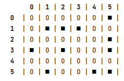
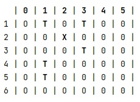
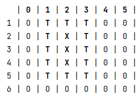
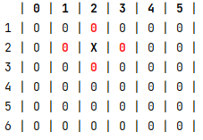
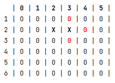
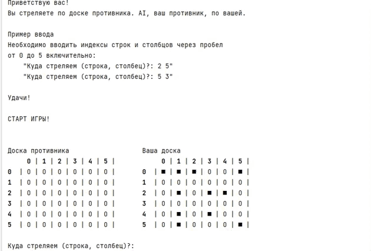
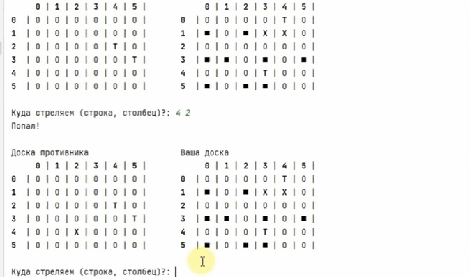
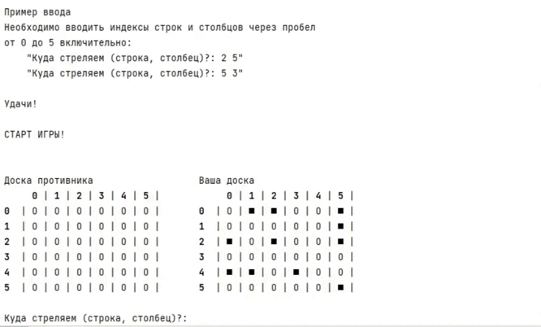

# Игра Морской бой

## Содержание

- [Описание](#описание-игры)
- [Установка](#установка-и-запуск)
- [Файловая структура](#файловая-структура)
- [Демонстрация](#демонстрация)

## Описание
Игра для двух игроков. Второй игрок - это компьютер (**AI**).
Каждый игрок имеет свою доску размером 6х6 клеток на которых отмечены корабли:\
4 - однопалубных; 2 - двухпалубных; 1 - трехпалубный.\
Расположение кораблей скрыто от другого игрока.
Корабли расставляются случайным образом, но так, чтобы не выходили 
за пределы игрового поля и не соприкасались друг с другом.
Игроки по очереди стреляют по доске противника. Если один из игроков попал по 
кораблю - второй игрок ход пропускает. Игра продолжается, пока один из игроков не уничтожит флот 
противника.\
Промахи отмечаются символом "**T**", попадания - "**X**".\
\
Если корабль убит полностью, его контур также обводится символом "**T**".\

#### Как сделать ход
Водятся исключительно целые числа от 0 до 5 включительно!
Первое значение - это номер строки, а второе значение - это номер столбца. 
Программа задаст вопрос `"Куда стреляем (строка, столбец)?: "` после чего 
ожидает от вас два целых числа разделенных пробелом. Любой другой ввод считается 
некорректным и вам будет предложенно ввести значение повторно.
Стрелять в одну и туже клетку нельзя. Если ввести повторно координаты ячейки, в 
которую уже был выстрел на экране появится предупреждене и будет предложено ввести 
числа заново.

#### Пример ввода значений
~~~python
Доска противника                   Ваша доска
     0 | 1 | 2 | 3 | 4 | 5 |            0 | 1 | 2 | 3 | 4 | 5 |
0  | О | О | О | О | О | О |       0  | ■ | О | О | ■ | О | ■ |
1  | О | О | О | О | О | О |       1  | ■ | О | О | ■ | О | О |
2  | О | О | О | О | О | О |       2  | ■ | О | О | О | О | О |
3  | О | О | О | О | О | О |       3  | О | О | О | ■ | О | ■ |
4  | О | О | О | О | О | О |       4  | О | О | О | О | О | О |
5  | О | О | О | О | О | О |       5  | О | ■ | О | ■ | ■ | О |

Куда стреляем (строка, столбец)?: 2 3
Ход AI (строка, столбец): 4 0

Доска противника                   Ваша доска
     0 | 1 | 2 | 3 | 4 | 5 |            0 | 1 | 2 | 3 | 4 | 5 |
0  | О | О | О | О | О | О |       0  | ■ | О | О | ■ | О | ■ |
1  | О | О | О | О | О | О |       1  | ■ | О | О | ■ | О | О |
2  | О | О | О | T | О | О |       2  | ■ | О | О | О | О | О |
3  | О | О | О | О | О | О |       3  | О | О | О | ■ | О | ■ |
4  | О | О | О | О | О | О |       4  | T | О | О | О | О | О |
5  | О | О | О | О | О | О |       5  | О | ■ | О | ■ | ■ | О |

Куда стреляем (строка, столбец)?:
~~~

#### Игрок AI
**AI** делает ход наугад. Если попадает в корабль - следующие шаги будут направлены
на 4 соседние клетки, пока они не закончатся.
Нпример, **AI** сделал выстрел и попал в корабль, клетка **(1,4)**. Следующим шагом у него 
будет одна из клеток **(1,2) (3,2) (2,3) (2,1)**. Значение выбирается случайным образом уже 
из последнего списка.\
Если следующим шагом выстрел также был успешным - значение соседей меняется. Если **AI**
промахнулся - значения сбрасываются и идёт случайная стрельба по всему полю, пока не будет
попадание по кораблю.\
_* Это сделано для интереса. У **AI** нет логики по уничтожению ваших кораблей. В целом можно
считать, что стрельба идет случайным образом._

 

И так до тех пор, пока не будут уничтожены все корабли.

## Установка и запуск
1. Убедитесь, что у вас установлен python версии 3.8 или выше.
2. Клонируйте этот репозиторий: `git clone https://github.com/SvetlanaKrasnova/game_sea_battle.git`
3. Запустите проект: `python main.py`

## Файловая структура
~~~python
game_sea_battle/
├── exceptions/
│   └── exceptions.py # Классы с описанием exceptions
├── files/
│   └── files_readme/ # Фалы для README.md
├── src/
│   ├── players/
│   │   ├── ai.py # Описание игрока AI
│   │   └── player.py # Описание пользователя
│   ├── board.py # Описание доски
│   ├── dot.py # Класс точки (ячейки)
│   ├── game.py # Основная логика игры
│   └── ship.py # Описание корабля
├── main.py 
├── README.md
~~~

## Демонстрация
#### Пример ввода значений

---
#### Пример полного затопления корабля

---
#### Пример полного цикла игры

